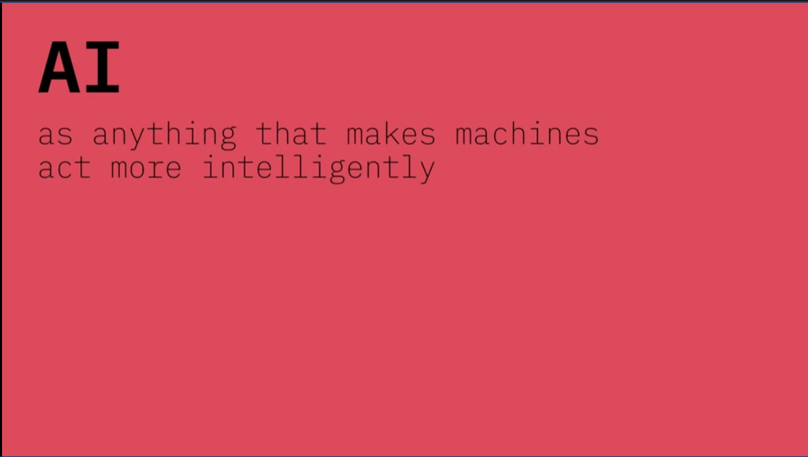
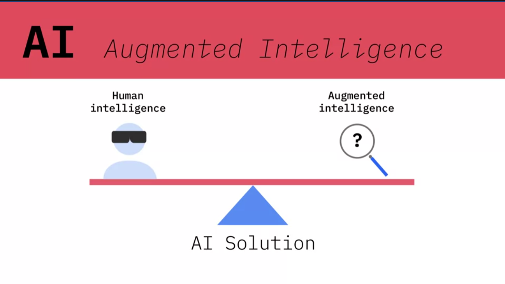
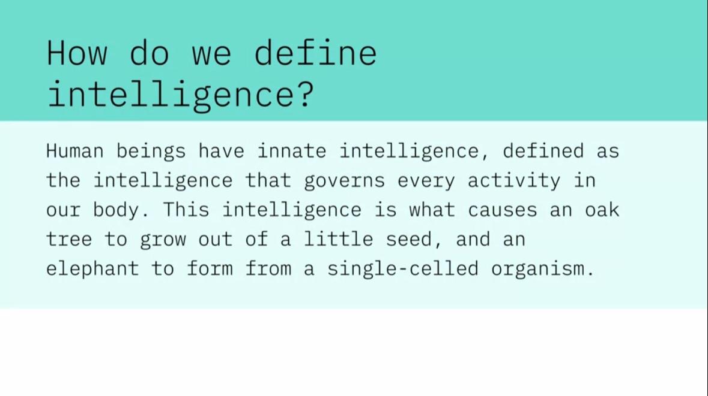
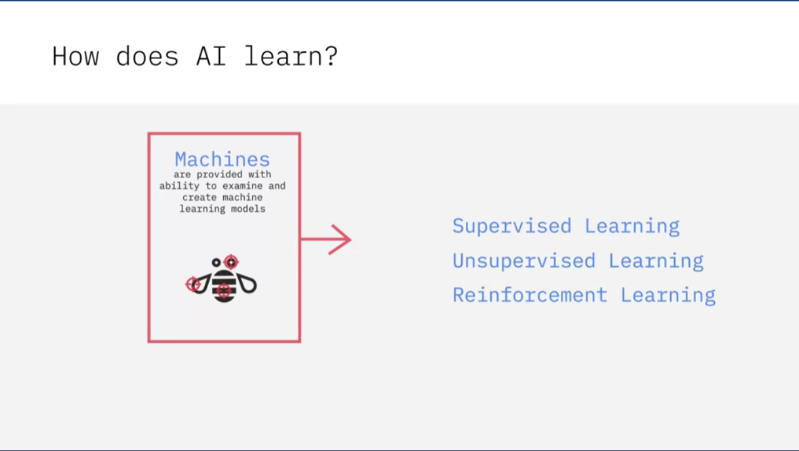
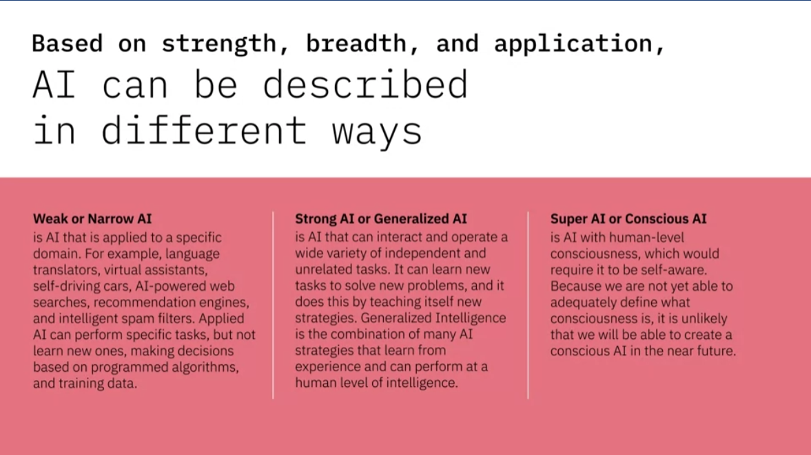
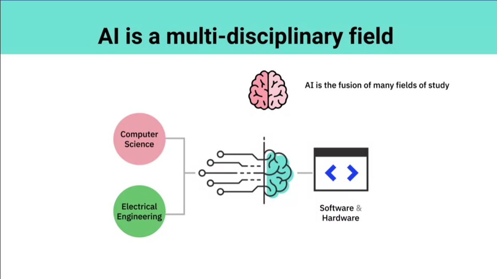
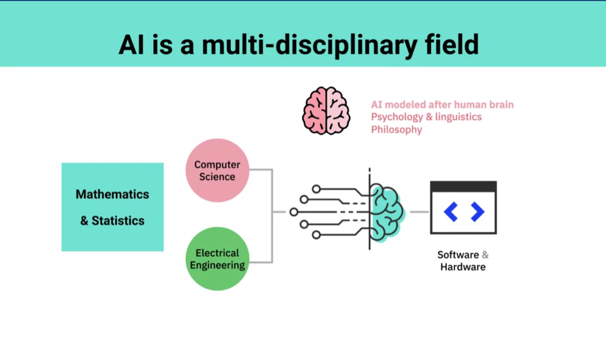
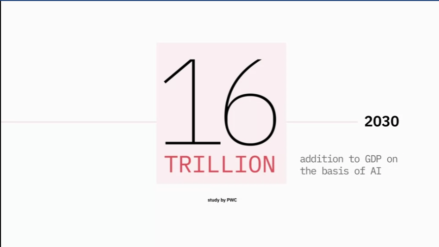
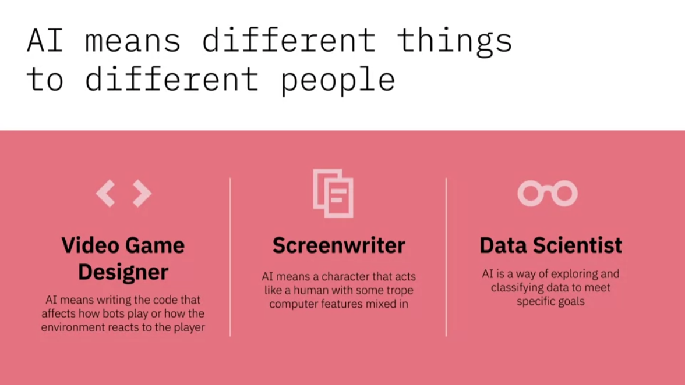
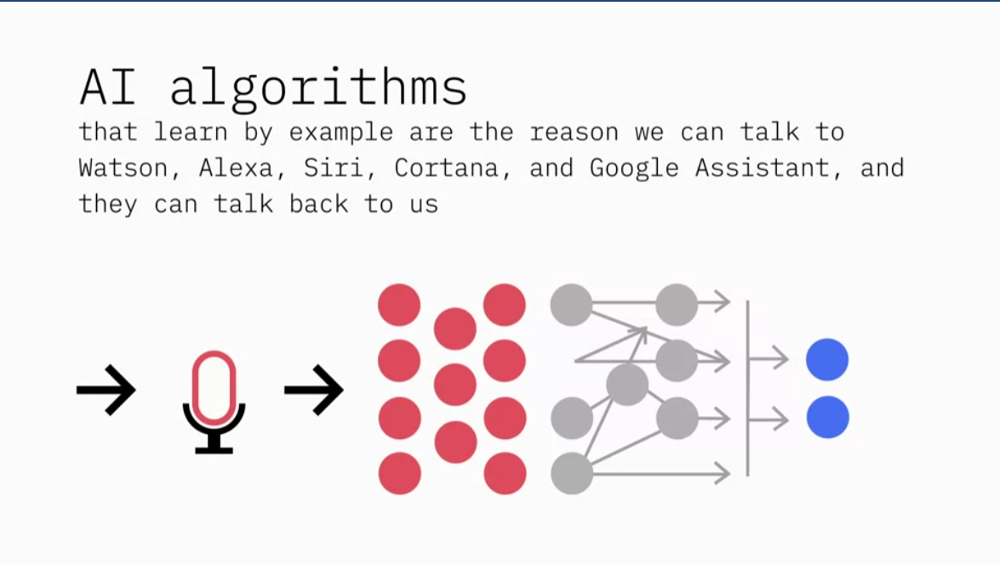

# Table of Contents
1. [Who Should take the course ?](#who-should-take-the-course)
2. [What is AI ?](#what-is-ai)
    - [Lesson Summary](#lesson-summary)
3. [Impact of AI: Applications and Examples](#impact-of-ai-applications-and-examples)
    - [Impact and Examples](#impact-and-examples)
    - [Lesson Summary](#lesson-summary-2)

# Who Should take the course ?

This Introduction to AI course is designed for anyone who wants to learn about Artificial Intelligence (AI). Whether you have a technical background or not, whether you are an executive, developer, a student, or some combination of the three or something completely different, if you are beginning your AI journey, this is a great place to start. It involves several hands on labs but does not involve any programming effort.

# What is AI ?

AI stands for Artifical Intelligence.

At IBM, we define AI as anything that makes machines act more intelligently.
We believe that AI should not attempt to replace human experts, but rather extend human capabilities and accomplish tasks that neither humans nor machines could do on their own. The internet has given us access to more information, faster. Distributed computing and IoT have led to massive amounts of data, and social networking has encouraged most of that data to be unstructured. With Augmented Intelligence, we are putting information that subject matter experts need at their fingertips, and backing it with evidence so they can make informed decisions. We want experts to scale their capabilities and let the machines do the time-consuming work. How do we define intelligence? Human beings have innate intelligence, defined as the intelligence that governs every activity in our body. This intelligence is what causes an oak tree to grow out of a little seed, and an elephant to form from a single-celled organism.

How do we define intelligence? Human beings have innate intelligence, defined as the intelligence that governs every activity in our body. This intelligence is what causes an oak tree to grow out of a little seed, and an elephant to form from a single-celled organism.

How does AI learn?
The only innate intelligence machines have is what we give them. We provide machines the ability to examine examples and create machine learning models based on the inputs and desired outputs. And we do this in different ways such as Supervised Learning, Unsupervised Learning, and Reinforcement Learning, about which you will learn in more detail in subsequent lessons. 

Based on strength, breadth, and application, AI can be described in different ways. 

- **Weak or Narrow AI** is AI that is applied to a specific domain. For example, language translators, virtual assistants, self-driving cars, AI-powered web searches, recommendation engines, and intelligent spam filters. Applied AI can perform specific tasks, but not learn new ones, making decisions based on programmed algorithms, and training data. 

- **Strong AI or Generalized AI** is AI that can interact and operate a wide variety of independent and unrelated tasks. It can learn new tasks to solve new problems, and it does this by teaching itself new strategies. Generalized Intelligence is the combination of many AI strategies that learn from experience and can perform at a human level of intelligence. 

- **Super AI or Conscious AI** is AI with human-level consciousness, which would require it to be self-aware. Because we are not yet able to adequately define what consciousness is, it is unlikely that we will be able to create a conscious AI in the near future. AI is the fusion of many fields of study.

AI is the fusion of many fields of study. Computer science and electrical engineering determine how AI is implemented in software and hardware. 

Mathematics and statistics determine viable models and measure performance. Because AI is modeled on how we believe the brain works, psychology and linguistics play an essential role in understanding how AI might work. And philosophy provides guidance on intelligence and ethical considerations. 

While the science fiction version of AI may be a distant possibility, we already see more and more AI involved in the decisions we make every day. Over the years, AI has proven to be useful in different domains, impacting the lives of people and our society in meaningful ways.

## Lesson Summary
In this lesson, you have learned:
IBM Research defines Artificial Intelligence (AI) as Augmented Intelligence, helping experts scale their capabilities as machines do the time-consuming work.

AI learns by creating machine learning models based on provided inputs and desired outputs.    

AI can be described in different ways based on strength, breadth, and application - Weak or Narrow AI, Strong or Generalized AI, Super or Conscious AI.

AI is the fusion of many fields of study, such as Computer Science, Electrical Engineering, Mathematics, Statistics, Psychology, Linguistics, and Philosophy. 

# Impact of AI: Applications and Examples

## Impact and Examples of AI

AI is here to stay, with the promise of
transforming the way the world works. According to a study by PWC, $16 trillion of GDP will be added between now and 2030 on the basis of AI. This is a never before seen scale of economic impact, and it is not just in the IT industry, it impacts virtually
every industry and aspect of our lives. 

AI means different things to different people. 

- For a **Videogame Designer**, AI means writing the code that affects how bots play, and how the environment reacts to the player. 

- For a **Screenwriter**, AI means a character that acts like a human, with some trope of computer features mixed in. 

- For a ** Data Scientist**, AI is a way of exploring and classifying data to meet specific goals. 

AI algorithms that learn by example are the reason we can talk to Watson, Alexa, Siri, Cortana, and Google Assistant, and they can talk back to us. 

The natural language processing and natural language generation capabilities
of AI are not only enabling machines and humans to understand and
interact with each other, but are creating new opportunities and
new ways of doing business. 

Chatbots powered by natural language processing capabilities, are being used in 

- healthcare to question patients and run basic diagnoses like real doctors. 

- In education, they are providing students with easy to learn conversational
interfaces and on-demand online tutors. 

- Customer service chatbots are improving customer experience by resolving queries on the spot and freeing up agents time for conversations that add value. 

AI-powered advances in speech-to-text technology have made real time transcription a reality. Advances in speech synthesis are the reason companies are using AI-powered voice to enhance customer experience, and give their brand its unique voice. 

In the field of medicine, it's helping patients with Lou Gehrig's disease, for example, to regain their real voice in place of using a computerized voice. 

**Computer Vision**
- It is due to advances in AI that the field of computer vision has been able to surpass humans in tasks related to detecting and labeling objects. 
- Computer vision is one of the reasons why cars can steer their way on streets and highways and avoid hitting obstacles. 
- Computer vision algorithms detect facial features and images and compare them with
databases of face profiles. 
        This is what allows consumer devices to authenticate the identities of their owners through facial recognition, social media apps to detect and tag users, and law enforcement agencies to identify criminals in video feeds. 
- Computer vision algorithms are helping automate tasks. Such as detecting cancerous moles in skin images or finding symptoms in x-ray and MRI scan. 

AI is impacting the quality of our lives on a daily basis. 
- There's AI in our Netflix queue, our navigation apps, keeping spam out of our inboxes and reminding us of important events.
- AI is working behind the scenes monitoring our investments, detecting fraudulent transactions, identifying credit card fraud, and preventing financial crimes. 
- AI is impacting healthcare in significant ways, by helping doctors arrive at more accurate preliminary diagnoses, reading medical imaging, finding
appropriate clinical trials for patients. It is not just influencing patient outcomes but also making operational processes less expensive. 

AI has the potential to access enormous amounts of information, imitate humans, even specific humans, make life-changing recommendations about health and finances, correlate data that may invade privacy, and much more.

## Lesson Summary 2

AI-powered applications are creating an impact in diverse areas such as Healthcare, Education, Transcription, Law Enforcement, Customer Service, Mobile and Social Media Apps, Financial Fraud Prevention, Patient Diagnoses, Clinical Trials, and more.

Some of these applications include:

- Robotics and Automation, where AI is making it possible for robots to perceive unpredictable environments around them in order to decide on the next steps.
- Airport Security, where AI is making it possible for X-ray scanners to flag images that may look suspicious.
- Oil and Gas, where AI is helping companies analyze and classify thousands of rock samples to help identify the best locations to drill for oil? 

Some famous applications of AI from IBM include:
- Watson playing Jeopardy to win against two of its greatest champions, Ken Jennings and Brad Rutter.
- Watson teaming up with the Academy to deliver an amplified Grammy experience for millions of fans.
- Watson collaborating with ESPN to serve 10 million users of the ESPN Fantasy App sharing insights that help them make better decisions to win their weekly matchups.

