# Topic: Introduction to Watson AI

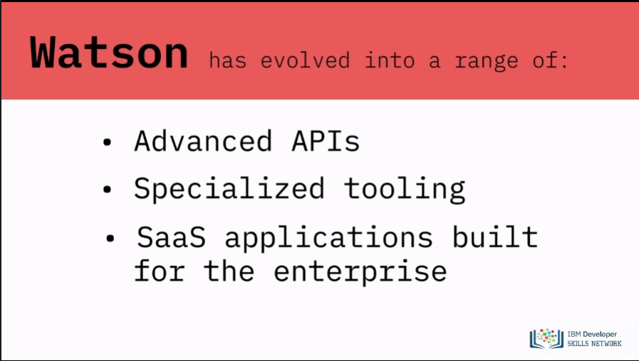
- Watson is an AI developed by IBM.
- Designed to make businesses smarter and improve employee performance.
- Includes a range of advanced APIs, specialized tooling, and Software as a - Service applications.
- Built for complex use cases and integration with professional platforms.
- Provides seamless access to information for decision-making.

# Topic: Watson AI Services and Tools

**Watson Assistant:**
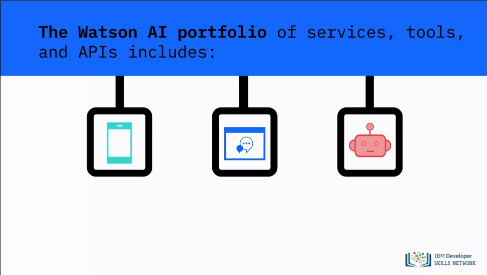
- Builds chatbots and virtual assistants for various channels.
- Supports mobile devices, messaging platforms, and robots.

**Watson Discovery:**
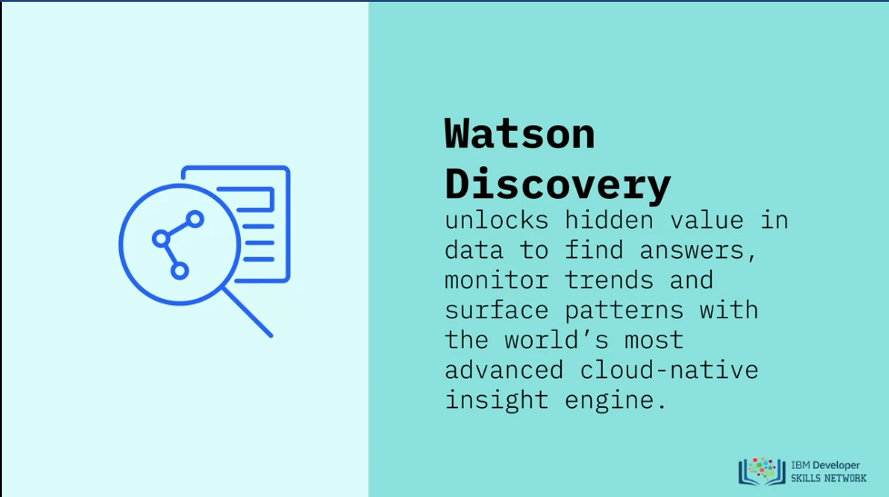
- Unlocks hidden value in data.
- Finds answers, monitors trends, and analyzes service patterns.
- Uses an advanced cloud-native insight engine.

**Watson Studio:**
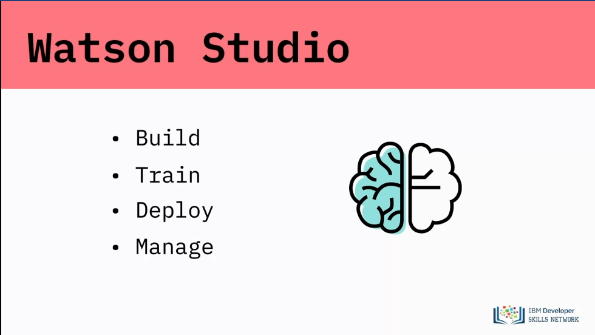
- Builds, trains, deploys, and manages AI models.
- Prepares and analyzes data in a single integrated environment.

**Watson Machine Learning:**
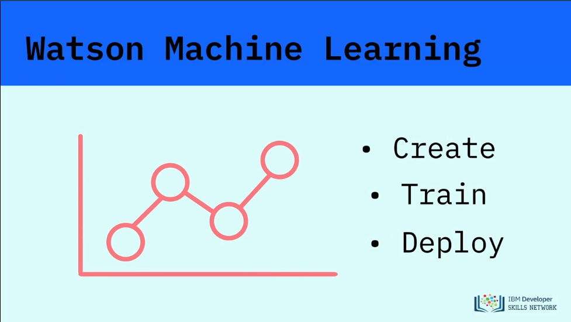
- Enables creation, training, and deployment of machine learning and deep learning models.
- Utilizes user-specific data.

**Watson Visual Recognition:**
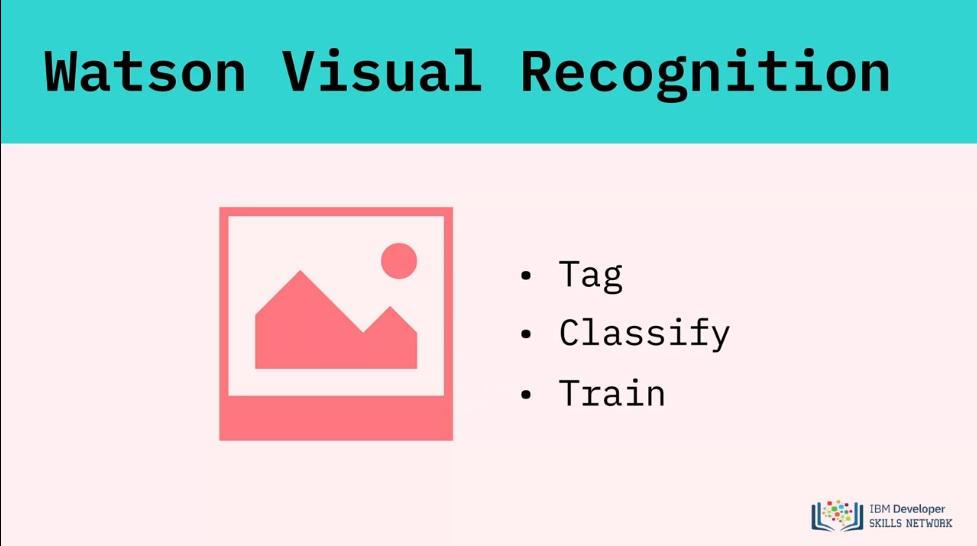
- Tags, classifies, and trains visual content using machine learning.

**Watson Knowledge Catalog:**
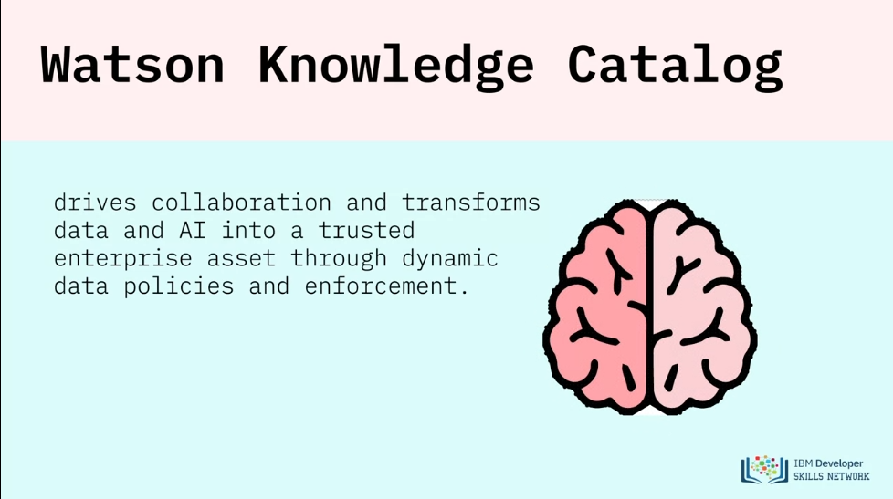
- Drives collaboration and transforms data and AI into a trusted enterprise asset.
- Implements dynamic data policies and enforcement.

**Watson Knowledge Studio:**
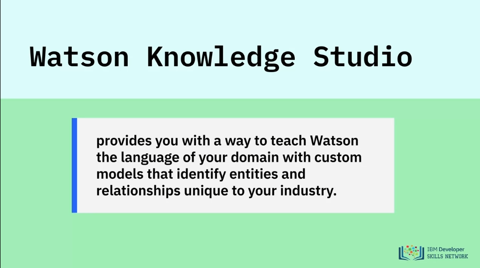
- Teaches Watson the language of a specific domain.
- Creates custom models to identify unique entities and relationships.

**Watson OpenScale:**
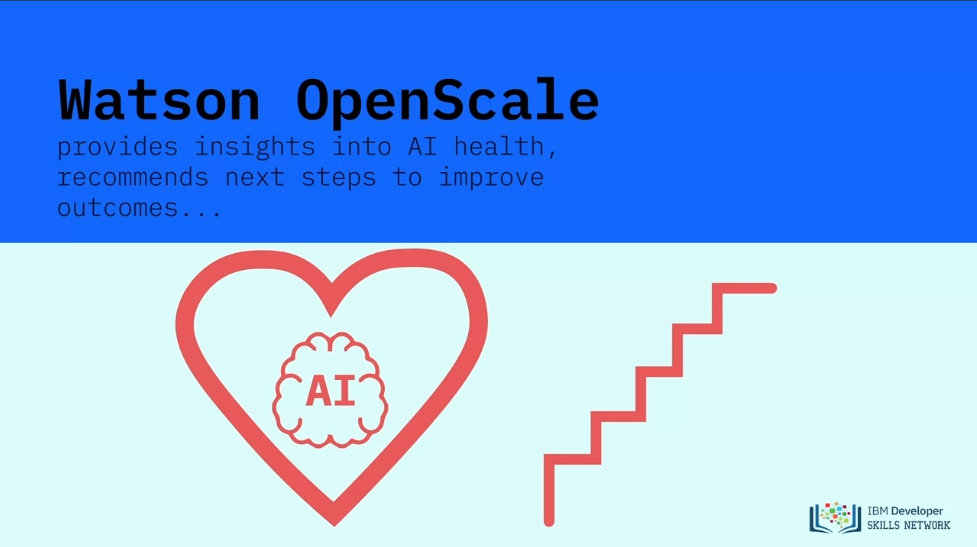
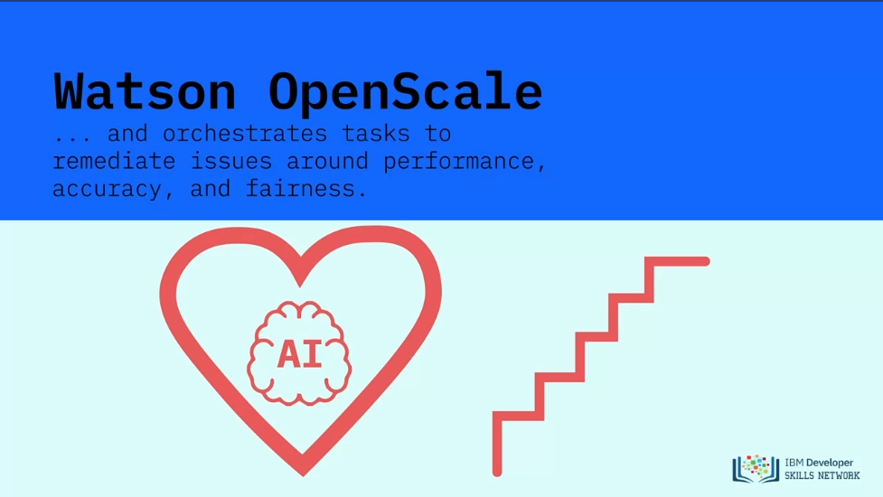
- Provides insights into AI health.
- Recommends next steps for improving outcomes.
- Orchestrates tasks to address performance, accuracy, and fairness issues.

**Watson Compare and Comply:**
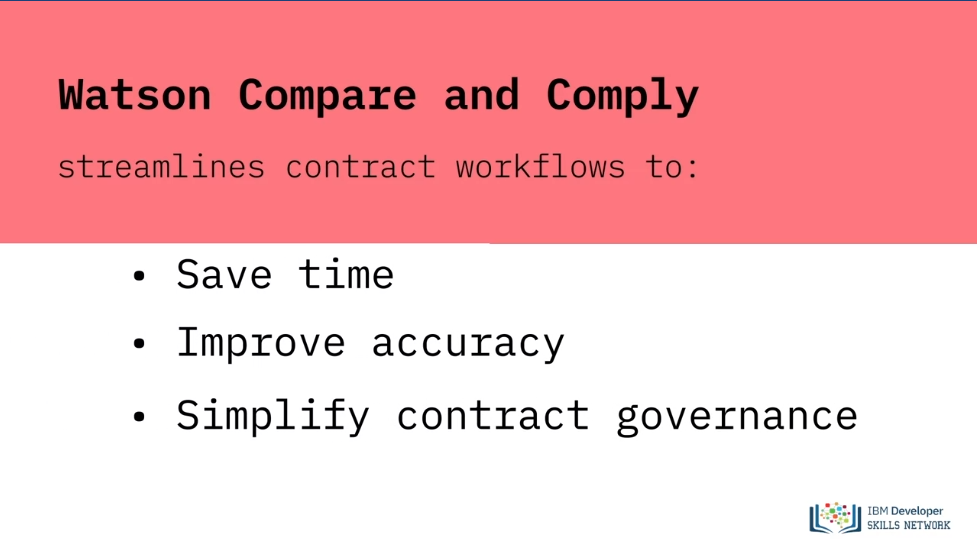
- Streamlines contract workflows.
- Saves time, improves accuracy, and simplifies contract governance.

**Additional Watson AI services and tools:**
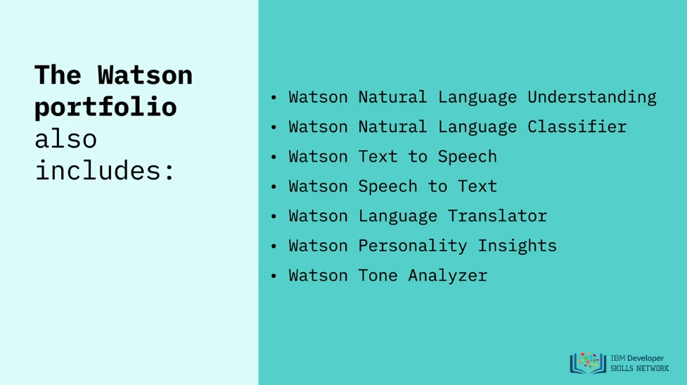
- Watson Natural Language Understanding.
- Watson Natural Language Classifier.
- Watson Text to Speech.
- Watson Speech to Text.
- Watson Language Translator.
- Watson Personality Insights.
- Watson Tone Analyzer.

# Topic: Benefits and Capabilities of Watson AI

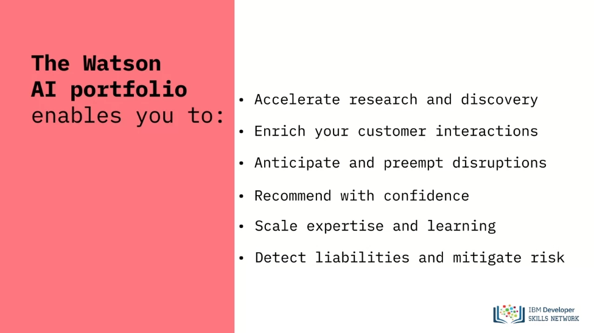
- Accelerates research and discovery.
- Enhances customer interactions.
- Anticipates and preemptively addresses disruptions.
- Provides confident recommendations.
- Scales expertise and learning.
- Detects liabilities and mitigates risks.

# Topic: Ownership and Portability of Watson AI

- Watson gives users complete control over their data, models, learning, and APIs.
- Achieves high accuracy with lower training costs.
- Designed for proprietary enterprise data.
- Initially available only on IBM Cloud but now portable across any cloud.
- Organizations can run IBM Watson services on any cloud (public or private).
- Prevents vendor lock-in and allows deployment of AI wherever data resides.

# Topic: Utilizing Watson AI
- Discover new trends and insights.
- Predict potential future outcomes.
- Automate aspects of applications, products, services, or businesses.
- Focus on making informed decisions.

# Lesson Summary

In this lesson, you have learned:
- IBM Watson provides a portfolio services, tools, and APIs to enable businesses to use and develop AI powered applications.
- The Watson AI portfolio enables you to perform a wide range of tasks, including accelerate research and discovery, enrich your customer interactions, scale expertise and learning, and detect liabilities and mitigate risk.
- Watson is available on any cloud empowered business.

To learn more about Watson services, visit:

- [IBM Watson](https://www.ibm.com/watson)